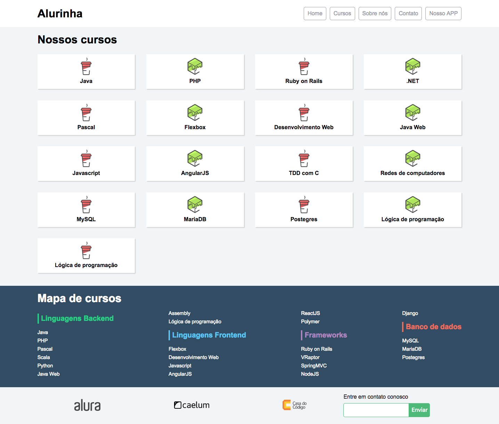

<h1 align="center" >
    ALURINHA
</h1>

<h3 align="center">
    O projeto Alurinha foi criado para treinar o conhecimento em CSS FlexBox feito na Alura.
</h3>

## 🛠 Tecnologias

O projeto foi desenvolvido utilizando as seguintes tecnologias:

- HTML
- CSS
- JavaScript

## 🎨 Layout

 https://alurinha-flex.netlify.app/ 

<b>Feito com 	:coffee:   por Larisse Lima</b>

